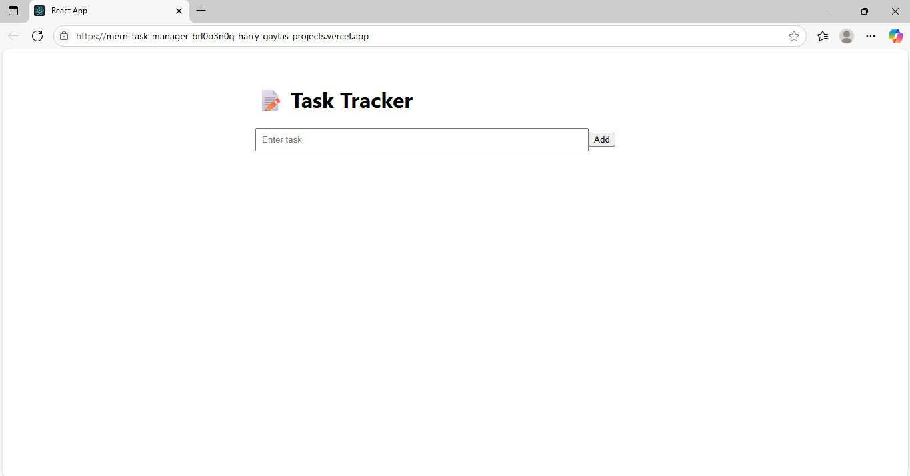

# 📝 MERN Task Tracker

A simple, full-stack task tracker built using the **MERN stack** (MongoDB, Express, React, Node.js). This app allows users to add, delete, and complete tasks, showcasing basic CRUD functionality and frontend-backend integration.

---

## 🚀 Tech Stack

- **Frontend**: React, Axios, CSS
- **Backend**: Node.js, Express
- **Database**: MongoDB (via MongoDB Atlas)
- **Hosting**: Vercel (frontend), Render (backend)

---

## 📸 Screenshot



> Replace this image with an actual screenshot of your running app.

---

## 📁 Folder Structure

```
mern-task-tracker/
├── backend/
│   ├── .env
│   ├── server.js
│   └── package.json
│
├── frontend/
│   ├── public/
│   ├── src/
│   │   ├── components/
│   │   ├── App.js
│   │   └── index.js
│   ├── package.json
│
├── .gitignore
└── README.md
```

---

## ⚙️ Installation & Setup

### 1. Clone the repository

```bash
git clone https://github.com/your-username/mern-task-tracker.git
cd mern-task-tracker
```

---

### 2. Backend Setup

```bash
cd backend
npm install
```

Create a `.env` file:

```env
MONGO_URI=mongodb+srv://<username>:<password>@cluster.mongodb.net/tasktracker
```

Start the server:

```bash
node server.js
```

---

### 3. Frontend Setup

```bash
cd frontend
npm install
npm start
```

The app will run at: [http://localhost:3000](http://localhost:3000)

---

## 📦 Available Commands

### Git Commands

```bash
git init
git add .
git commit -m "Initial commit"
git remote add origin https://github.com/your-username/mern-task-tracker.git
git push -u origin main
```
---

## 🛡️ .gitignore

Create a `.gitignore` file in the root and include:

```
node_modules/
.env
.DS_Store
/build
/dist
```

---

## ☁️ Deployment Suggestions

- **Frontend**: [Vercel](https://vercel.com/)
- **Backend**: [Render](https://render.com/)
- **Database**: [MongoDB Atlas](https://www.mongodb.com/cloud/atlas)

---

## ✍️ Author

**Harry** — Computer Engineer
📫 Contact: harrygayla@gmail.com (replace with yours)

---

## ⭐ License

This project is open source and available under the [MIT License](LICENSE).
